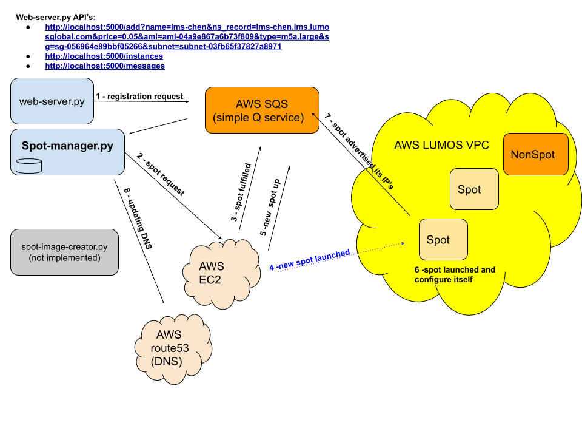

# spot-manager
spot instance manager implemented in python3

The spot-manager manages the lifecycle of the spot instances. 
Its duty is to respond to SPOT_INTERRUPTION notifications, and request a new spot, hiding the complexity from the user. 

### Modules
1. spot-manager (listens infinitely to SQS queue and handle messages)
2. web-server (currently only notify the spot-manager for a new registration)
3. spot-image-creator (creates daily ami from spot and notify SQS *** NOT IMPLEMENTED YET ***)

*** NOTE: web-server is the only way to add a managed instance

### System components

### Workflow example
1. user request to add instance lms-chen to web-server
1a. web server publishes SQS message for registration
1b. spot-manager poller receive the message and add lms-chen to a local db (its now managed)
2. spot-manager requests a new spot (sir) and updates the sir for lms-chen
3. sir is fulfilled by amazon
4. new spot launched the iid returned is updated for lms-chen
5. spot-manager updates its local db with new iid
6. the spot is running cloud-init code (once) for app reconfiguration (tomcat) with the new private ip address
7. the spot publish an SQS message with the new public_ip  and reboots
8. spot-manager receives the new spot message from SQS and changes the ns_record (route53) to refer to the new public ip address
8. user can now ping lms-chen.lms.lumosglobal.com
NOTE TESTED YET:
9. aws will notify SQS with "SPOT INTERRUPTION" 2 minutes before spot will go down
10. spot-manager will do again steps 4->8

### Assumptions
1. vm has self-deploy script
2. python 3.6 - 3.8 installed
3. cloud-init is working wo errors
4. vm has iam cred to send sqs msg
5. spot-image-creator 

*** NOTE

TODO:
1. implement spot-image-creator
2. implement new-spot-image-created handler to updates the local record (next spot will use new image)

